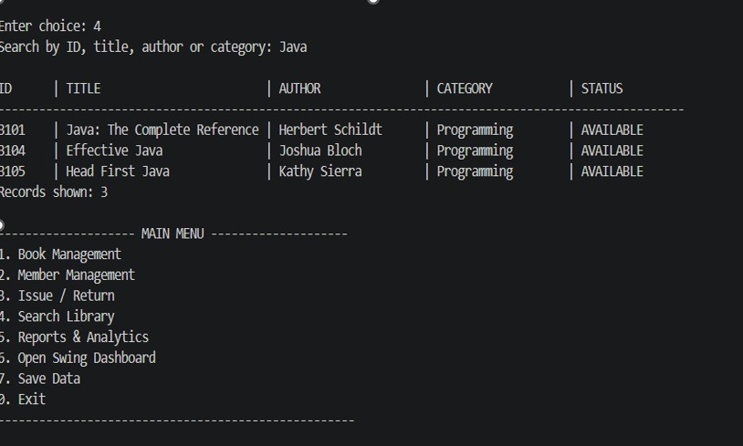
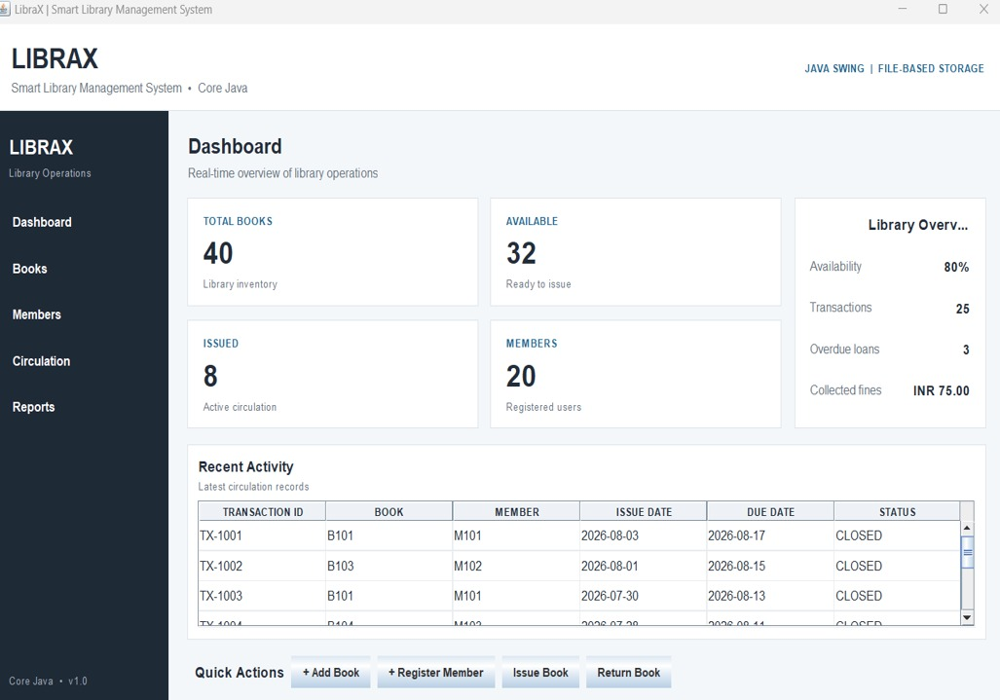

# 📚 LibraX — Smart Library Management System

A Core Java-based Library Management System designed to manage books, members, circulation, search, persistence, and library analytics.

LibraX demonstrates practical Core Java concepts through a modular application with both a **Command-Line Interface (CLI)** and a **Java Swing Dashboard**.

---

## 📌 Overview

Managing books, members, borrowing records, returns, due dates, fines, and reports manually can become difficult as the size of a library increases.

**LibraX** provides a standalone Java-based solution for these operations.

The system allows librarians to:

- Manage books
- Register and manage members
- Issue and return books
- Track due dates
- Calculate overdue fines
- Search the library catalogue
- View library statistics
- Generate reports
- Persist data using local files

The project is implemented using **Core Java** and does not require JDBC, MySQL, or any external database.

---

# 🎯 Features

## 📚 1. Book Management

LibraX supports complete book management operations:

- Add new books
- Update book information
- Remove books
- View available books
- Track issued books
- Search books

Books can be searched using:

- Book ID
- Title
- Author
- Category

---

## 👤 2. Member Management

The system supports:

- Registering new members
- Viewing member information
- Multiple membership types
- Student membership
- Regular membership
- Premium membership
- Membership-specific borrowing limits
- Tracking currently borrowed books

---

## 🔄 3. Book Circulation

The circulation module handles:

- Issuing books to members
- Returning borrowed books
- Automatic due-date calculation
- Tracking active transactions
- Tracking overdue books
- Calculating overdue fines
- Maintaining transaction history

---

## 🔎 4. Library Search

Books can be searched using:

- Book ID
- Title
- Author
- Category

The search functionality helps librarians quickly locate books and check their availability.

---

## 📊 5. Reports & Analytics

LibraX provides analytical information including:

- Inventory summary
- Book availability statistics
- Member and librarian counts
- Transaction statistics
- Overdue-loan information
- Collected fines
- Outstanding fines
- Category-wise book statistics
- Most-borrowed books
- Most-active members
- Detailed overdue-loan analysis
- Availability-rate calculation
- Exportable library report

Report generation also demonstrates Java multithreading through the `ReportService` class.

---

# 🖥️ User Interfaces

LibraX provides two ways to interact with the system.

## 1. Command-Line Interface

The CLI provides a menu-driven interface for performing library operations.

```text
========== LIBRAX ==========

1. Book Management
2. Member Management
3. Issue / Return
4. Search Library
5. Reports & Analytics
6. Open Swing Dashboard
7. Save Data
8. Exit
```

The CLI provides access to the major library management workflows.

---

## 2. Java Swing Dashboard

LibraX also provides a desktop graphical interface built using **Java Swing**.

The dashboard includes:

- Library statistics
- Recent circulation activity
- Books section
- Members section
- Circulation section
- Reports section
- Quick actions

Both interfaces use the same underlying library business logic.

---

# 🧠 Core Java Concepts Used

The project demonstrates practical application of the following Core Java concepts:

- Classes and Objects
- Constructors
- Encapsulation
- Access Modifiers
- `this`
- `super`
- `static`
- `final`
- Abstract Classes
- Abstract Methods
- Inheritance
- Method Overloading
- Method Overriding
- Polymorphism
- Interfaces
- Enums
- Strings
- Arrays
- Collections
- `ArrayList`
- Exception Handling
- Custom Exceptions
- File I/O
- Object Streams
- Serialization
- Packages
- Multithreading
- Java Swing

---

# 🛠️ Technologies Used

| Technology / Concept | Purpose |
|---|---|
| Java | Core application development |
| Java Swing | Graphical desktop interface |
| `ArrayList` / `List` | In-memory data management |
| Java I/O | File operations |
| Object Serialization | Data persistence |
| `java.time` | Date and due-date handling |
| Exceptions | Error handling |
| Interfaces | Operation contracts |
| Abstract Classes | Object hierarchy |
| Inheritance | Member/Librarian specialization |
| Polymorphism | Object-oriented behavior |
| Enums | Status and membership types |
| `Thread` | Background report generation |

---

# 🏗️ System Architecture

LibraX follows a modular layered architecture.

```text
┌──────────────────────────────┐
│       User Interface         │
│      CLI + Swing GUI         │
└──────────────┬───────────────┘
               │
               ▼
┌──────────────────────────────┐
│     Service / Business       │
│   Library + ReportService    │
└──────────────┬───────────────┘
               │
               ▼
┌──────────────────────────────┐
│        Domain Model          │
│ Book • Member • Librarian    │
│ Person • Transaction         │
└──────────────┬───────────────┘
               │
               ▼
┌──────────────────────────────┐
│       File Persistence       │
│    FileHandler + .dat files  │
└──────────────────────────────┘
```

The same business logic is used by both the CLI and Swing interface.

---

# 📁 Project Structure

```text
LibraX/
│
├── src/
│   ├── app/
│   │   ├── LibraryManagementApp.java
│   │   └── LibraryGUI.java
│   │
│   ├── model/
│   │   ├── Person.java
│   │   ├── Member.java
│   │   ├── Librarian.java
│   │   ├── Book.java
│   │   └── Transaction.java
│   │
│   ├── service/
│   │   ├── Library.java
│   │   ├── LibraryOperations.java
│   │   ├── FileHandler.java
│   │   └── ReportService.java
│   │
│   └── exception/
│       ├── InvalidInputException.java
│       ├── MemberNotFoundException.java
│       └── BookNotAvailableException.java
│
├── data/
│   ├── books.dat
│   ├── members.dat
│   ├── librarians.dat
│   └── transactions.dat
│
├── docs/
│   ├── architecture.md
│   ├── workflow.md
│   ├── use-case.md
│   ├── class-diagram.md
│   └── sequence.md
│
├── tests/
│   └── TestCases.md
│
├── screenshots/
│   ├── cli-output.png
│   └── swing-dashboard.png
│
├── statement.md
├── README.md
├── run.bat
└── .gitignore
```

---

# 📦 Demonstration Dataset

The project includes a prepared demonstration dataset containing:

| Data | Quantity |
|---|---:|
| Books | 40 |
| Members | 20 |
| Librarians | 3 |
| Transactions | 25 |
| Currently Issued | 8 |
| Overdue Loans | 3 |
| Collected Fines | INR 75 |
| Availability | 80% |

The dataset is included to demonstrate realistic library operations and reporting.

---

# 🖼️ Output Screenshots

## 🔹 Command-Line Interface

The CLI supports menu-driven library operations including book management, member management, circulation, searching, and reports.



---

## 🔹 Java Swing Dashboard

The Swing dashboard provides a graphical representation of the library system.



The dashboard displays information such as:

- Total Books: 40
- Available Books: 32
- Issued Books: 8
- Members: 20
- Transactions: 25
- Overdue Loans: 3
- Collected Fines: INR 75.00
- Availability: 80%

---

# 💾 Data Persistence

LibraX uses **Java object serialization** for local data persistence instead of an external database.

Data is stored in:

```text
data/books.dat
data/members.dat
data/librarians.dat
data/transactions.dat
```

The application can:

1. Load existing records
2. Perform library operations
3. Update objects
4. Save updated data
5. Reload the data during the next execution

This allows library information to persist between application runs.

---

# ⚠️ Exception Handling

LibraX uses custom exceptions to handle invalid operations.

### `BookNotAvailableException`

Handles attempts to issue a book that is unavailable.

### `MemberNotFoundException`

Handles cases where a requested member does not exist.

### `InvalidInputException`

Handles invalid input and invalid application operations.

This improves reliability and prevents invalid operations from silently modifying library data.

---

# 📈 Reporting System

The reporting system processes information from books, members, and transactions.

Example report sections include:

- Library Inventory
- Member Statistics
- Transaction Statistics
- Availability Rate
- Overdue Loans
- Collected Fines
- Outstanding Fines
- Books by Category
- Most Borrowed Books
- Most Active Members

The generated report can be exported to:

```text
data/library-report.txt
```

Report generation also demonstrates Java multithreading through the `ReportService` class.

---

# 🧪 Testing

The project includes a test plan covering the major application workflows.

Testing scenarios include:

- Application startup
- Data loading
- Book search
- Book addition
- Duplicate book validation
- Member registration
- Book issue
- Book return
- Unavailable-book handling
- Invalid return handling
- Report generation
- Data persistence
- Swing dashboard launch

Detailed test cases are available in:

```text
tests/TestCases.md
```

---

# ⚙️ Installation

## Requirements

- **JDK 17 or later**
- Windows Command Prompt or PowerShell
- VS Code / IntelliJ IDEA / Eclipse (optional)

No external database or third-party library is required.

---

# ▶️ How to Run

## 1. Open the Project

Open the `LibraX` project folder in VS Code or a terminal.

Make sure the terminal is opened in the project root:

```text
LibraX/
```

---

## 2. Run the Command-Line Application

### PowerShell

Use:

```powershell
.\run.bat
```

### Command Prompt

Use:

```cmd
run.bat
```

The batch file compiles the Java source files and starts the LibraX command-line application.

---

## 3. Open the Swing Dashboard from CLI

After starting LibraX, select:

```text
6. Open Swing Dashboard
```

The Java Swing dashboard will open as a desktop window.

---

## 4. Launch the Swing GUI Directly

After the project has been compiled, the Swing dashboard can also be launched directly using:

```powershell
java -cp out app.LibraryGUI
```

This starts the graphical interface without opening the CLI menu first.

---

## 5. Manual Compilation

If `run.bat` is not used, the project can be compiled manually.

From the project root:

```powershell
if (!(Test-Path out)) { New-Item -ItemType Directory out }

javac -encoding UTF-8 -d out src\model\*.java src\exception\*.java src\service\*.java src\app\*.java
```

After successful compilation, run the CLI:

```powershell
java -cp out app.LibraryManagementApp
```

Or launch the Swing dashboard directly:

```powershell
java -cp out app.LibraryGUI
```

---

# 📚 Documentation

Additional project documentation is available in the `docs` directory.

### `architecture.md`

Describes the layered system architecture.

### `workflow.md`

Describes the overall application workflow.

### `use-case.md`

Describes the major user interactions and system use cases.

### `class-diagram.md`

Describes relationships between the major classes.

### `sequence.md`

Describes the book-issue workflow between the application components.

The project also contains:

```text
statement.md
```

for the problem statement, objectives, scope, and challenges.

Testing documentation is available at:

```text
tests/TestCases.md
```

---

# 🚀 Future Enhancements

Possible future improvements include:

- Librarian authentication
- Role-based access control
- Book reservation system
- Waiting lists
- Due-date notifications
- Barcode / QR code scanning
- Advanced analytics
- Statistical charts
- JDBC/database integration
- Multi-user network support
- Improved concurrency handling
- JUnit automated testing

---

# 💡 Project Objective

The primary objective of LibraX is to demonstrate how Core Java concepts can be applied to develop a complete real-world management application.

```text
              Core Java
                  ↓
        Object-Oriented Design
                  ↓
        Library Management
                  ↓
          File Persistence
                  ↓
         Reports & Analytics
                  ↓
           CLI + Swing GUI
                  ↓
        Complete Application
```

---

# 🎓 Academic Relevance

LibraX integrates multiple concepts from the Core Java curriculum into a single application.

The project demonstrates:

- Object-Oriented Programming
- Inheritance and Polymorphism
- Abstract Classes and Interfaces
- Collections
- Arrays
- Exception Handling
- Custom Exceptions
- File I/O
- Serialization
- Multithreading
- Java Swing
- Packages and Modular Design

This makes the project suitable as a practical Core Java academic project.

---

# 👨‍💻 Author

**MD FARHAN ALI**

Core Java Academic Project

---

# 📜 License

This project is developed for academic and educational purposes.